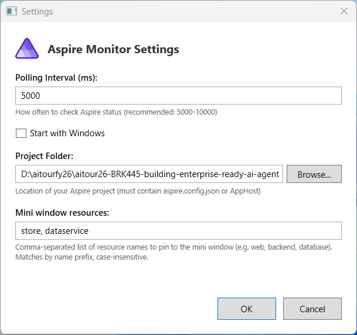

# Blog Post: AspireMonitor v1.4.0

## Title

**AspireMonitor v1.4.0 — Pin the Aspire resources you actually care about, right in your Windows tray**

---

## Headline

If you build distributed apps with Aspire, you already know the dashboard is great — but bouncing to a browser tab every time you want to know "is my API up?" is friction. **AspireMonitor** lives in your Windows system tray and gives you a one-click view of your Aspire AppHost: the resources that are running, the URLs that go to them, and a Start/Stop button so you can spin the whole thing up or shut it down without leaving your keyboard.

v1.4.0 is the version where this finally feels good for daily use: a pin-and-go mini window, full URLs (no more guessing what "Open" points to), and a Start button that stays disabled while Aspire is actually starting up.

---


The mini window above is the feature most people end up living in: pinned resources with their real URLs, plus Start / Stop and dashboard buttons. The main window (full resource list) is below.


## What it does (in one screen)

AspireMonitor is a small WPF tray app. You point it at the folder that contains your Aspire AppHost project, and from then on you get:

- A **tray icon** — click it to bring up the main window, right-click for menu, double-click to toggle.
- A **main window** — full list of resources discovered by `aspire describe`, with status, type, and clickable endpoints.
- A **mini window** — a compact, always-handy panel showing exactly the resources you pinned (and only those), each with its real URL.
- A **Start / Stop** pair of buttons — runs `aspire run` / sends the right shutdown sequence to your AppHost.
- A **dashboard link** — one click to open the Aspire dashboard in your browser when you actually do want it.

That's it. No agents, no daemons, no Docker images. Just a tray app that talks to the Aspire CLI in your working folder.

---

## What's new in v1.4.0

### 📌 Pinned resources in the mini window

Open Settings, type a comma-separated list like `web, dataservice, store`, and the mini window will pin those resources for you. Each pinned row shows the resource's real URL (not a generic "Open" link), so you can see at a glance what `web` actually resolves to — `http://localhost:5021`, the deployed gateway, whatever it is.

Resources without an endpoint (databases, queues, plain containers) still show up as text rows so you know they're configured — they just don't render as a link.

Matching is **case-insensitive prefix match**, which is what you want with Aspire because it suffixes replicas (`web-xggqzmyn`). Type `web`, get `web-xggqzmyn`. Type `WEB`, same result.

### ▶️ Start / Stop that actually behave

Two things were broken before v1.4.0:
- Stop didn't stop. Now it does, and the button disables itself while the shutdown is in flight.
- Start would re-enable itself the moment Aspire's gateway came up, which is way before resources are actually visible. So you'd click Start, the button would un-grey, you'd think "great", and then nothing would show up for another 60+ seconds.

Now Start stays disabled with a live countdown (`⏳ Starting Aspire... (12 / 90s)`) until resources actually appear, with a soft warning if the 90-second budget runs out. You can walk away, come back, and the UI will reflect reality.

### 🔗 Real URLs, not "Open"

Pinned resources used to render as a tidy little 🔗 Open link. Tidy — but useless when you have three pinned web resources and want to know which one is which. Now you see the actual URL inline.

### 🛡 Pinned-resource validation

If you pin `store` in your settings but no resource matches when the mini window opens, AspireMonitor doesn't crash — it logs the missing match and renders the pins it could resolve. Earlier builds had a path where two unmatched pins could prevent the mini window from opening at all; that's fixed.

---

## Settings, in detail

You configure AspireMonitor either from the in-app Settings dialog or by editing the JSON config directly:



```
%APPDATA%\Local\ElBruno\AspireMonitor\config.json
```

Real-world example:

```json
{
  "WorkingFolder": "C:\\Projects\\OpenClawNet\\src\\OpenClawNet.AppHost",
  "AspireHostUrl": "http://localhost:18888",
  "PollingIntervalMs": 2000,
  "MiniWindowResources": "web, store, gateway"
}
```

What each field does:

| Field | Purpose |
|---|---|
| `WorkingFolder` | Folder containing your Aspire `*.AppHost.csproj`. AspireMonitor runs `aspire describe` from here. |
| `AspireHostUrl` | URL of the Aspire dashboard. Default is `http://localhost:18888`; override if you've moved it. |
| `PollingIntervalMs` | How often to refresh the resource list. Default `2000`. |
| `MiniWindowResources` | Comma-separated list of resource name prefixes to pin to the mini window. Empty = mini window only shows the dashboard link. |

---

## The mini window

The mini window is the feature most people end up living in. It's small, sticks to a corner of your screen, and shows:

- The Aspire dashboard link
- Each pinned resource (in the order you typed them in settings) with its current URL
- The Start / Stop buttons with the countdown when starting

It's `SizeToContent="Height"` so it auto-grows for the number of pins you have — no scrollbar, no wasted space.

---

## How it works under the hood

There's no magic and no third-party Aspire SDK dependency. The pipeline:

1. **`AspireCliService`** shells out to `aspire describe --format json` against your working folder
2. **`AspirePollingService`** reschedules that call on a configurable interval and parses results into `AspireResource` records (name, type, status, URLs)
3. **`MainViewModel`** holds the resource collection and the Start/Stop commands
4. **`MiniMonitorViewModel`** filters the collection against `MiniWindowResources` (prefix match, case-insensitive) and exposes a `PinnedResources` collection
5. **WPF** binds it all to the tray icon, main window, mini window, and settings dialog

Every piece of business logic lives in `src/ElBruno.AspireMonitor/` with xUnit + Moq tests in `src/ElBruno.AspireMonitor.Tests/`.

---

## Install

```bash
dotnet tool install --global ElBruno.AspireMonitor
aspiremon
```

Update from a previous version:

```bash
dotnet tool update --global ElBruno.AspireMonitor
```

**Requirements:** Windows 10/11, [.NET 10 Runtime](https://dotnet.microsoft.com/en-us/download), Aspire CLI on your `PATH`.

---

## Roadmap

What I want to land next:

- **Multi-AppHost support** — switch between projects without restarting the tool
- **Per-resource quick actions** — restart, view logs, copy URL from a context menu
- **Cross-platform tray** — port the UI shell off WPF onto something macOS/Linux friendly (Avalonia is the leading candidate)
- **Notifications** — desktop toast when a pinned resource goes down or comes back

If any of these sound useful, [open an issue](https://github.com/elbruno/ElBruno.AspireMonitor/issues) and tell me which ones you'd actually use — I'll prioritize accordingly.

---

## Try it

```bash
dotnet tool install --global ElBruno.AspireMonitor
aspiremon
```

- **GitHub:** [github.com/elbruno/ElBruno.AspireMonitor](https://github.com/elbruno/ElBruno.AspireMonitor)
- **NuGet:** [nuget.org/packages/ElBruno.AspireMonitor](https://www.nuget.org/packages/ElBruno.AspireMonitor)
- **Issues / feedback:** [GitHub Issues](https://github.com/elbruno/ElBruno.AspireMonitor/issues)

MIT licensed, contributions welcome.

---

## About the author

**Bruno Capuano** ([@elbruno](https://github.com/elbruno)) — Microsoft AI MVP and GitHub Star. Builds open-source tools for .NET developers; blogs at [elbruno.com](https://elbruno.com).

---

> 📸 **Screenshots:** main window, mini window, and settings dialog are all included.
