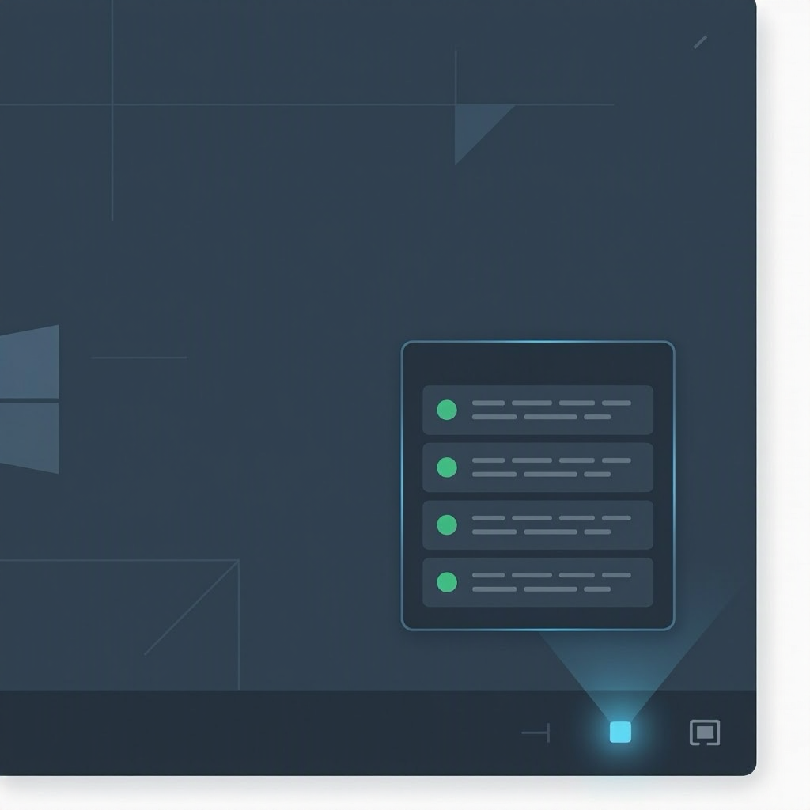
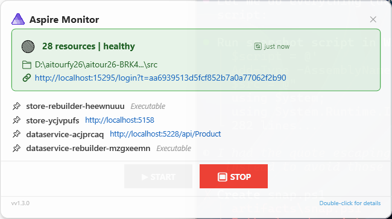
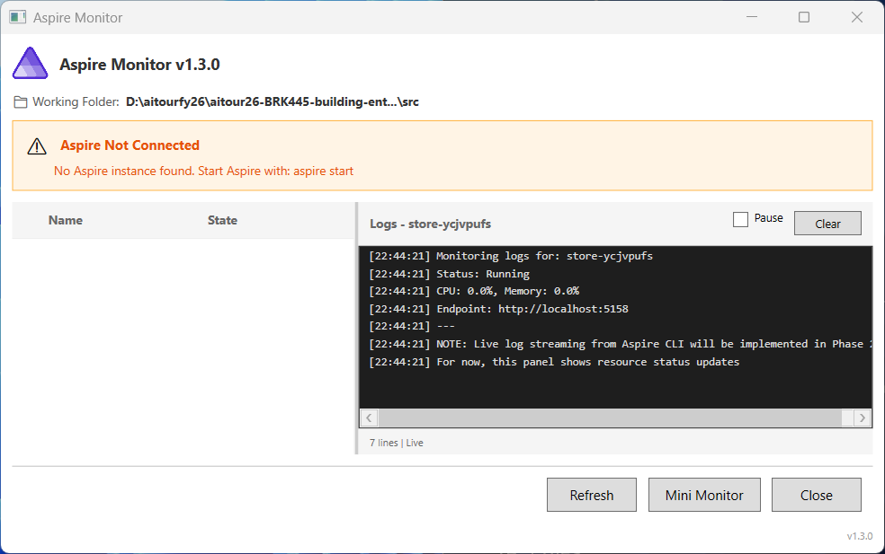

# AspireMonitor: Stop bouncing between your Aspire dashboard and your code.



```bash
dotnet tool install --global ElBruno.AspireMonitor
aspiremon
```

## What it is

AspireMonitor is a Windows tray app that puts your Aspire AppHost status one click away. No browser tabs. No switching context. Click the tray icon, see what's running, Start/Stop your app, or pin the resources you actually care about in a compact mini window.

## Why it exists

If you use Aspire, you know the dashboard is useful—but you don't want a browser tab open all day. You're writing code, not monitoring. AspireMonitor solves the friction: a lightweight tray icon that gives you "is my API up?" and "what URL does this service run on?" without leaving your IDE.

## Why it's useful

**v1.4.0 ships with two killer features:**

The mini window pins only the resources you care about (configure once: `web, store, gateway`) with their live URLs and Start/Stop buttons. The main window shows the full resource list when you need it.

Start now works correctly—it stays disabled with `⏳ Starting Aspire... (12 / 90s)` so you know when resources are actually ready. Stop actually stops. URLs are real (`http://localhost:5021`), not generic "Open" links.





## Get it

- **NuGet:** https://www.nuget.org/packages/ElBruno.AspireMonitor
- **GitHub:** https://github.com/elbruno/ElBruno.AspireMonitor
- **MIT licensed.** Issues and PRs welcome.

> Built with .NET 10 + WPF. Shells out to `aspire describe`—no third-party SDK dependency.
